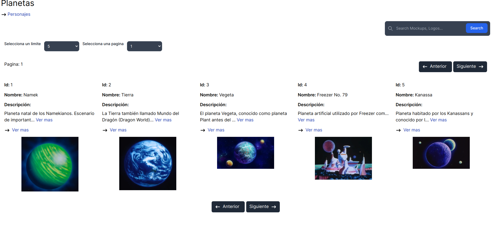
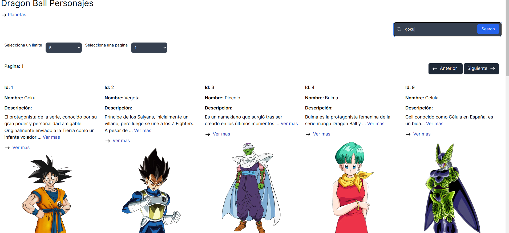
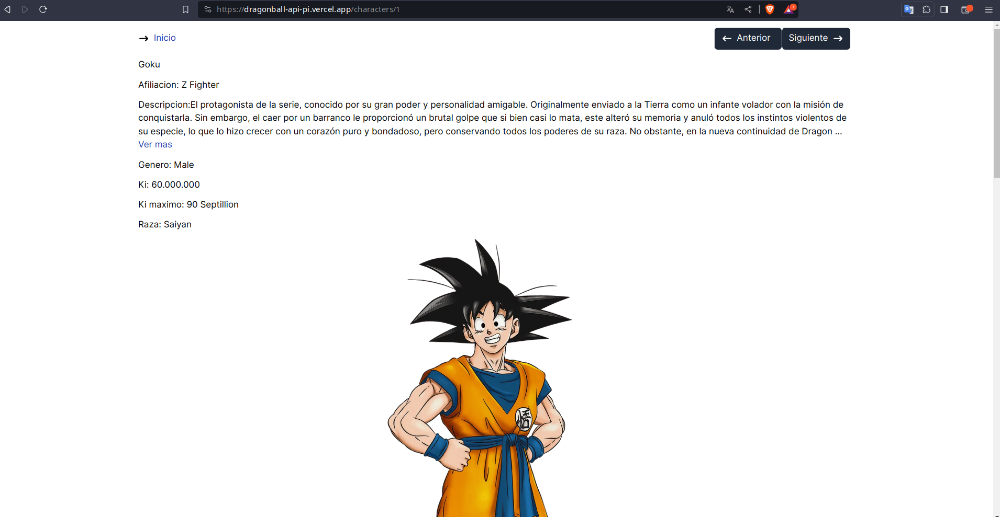

## Getting Started

First, run the development server:

```bash
npm run dev
# or
yarn dev
# or
pnpm dev
# or
bun dev
```

Open [http://localhost:3000](http://localhost:3000) with your browser to see the result.

## Learn More

Project with the consumption of the DragonBall API, in this project technologies such as; zustand for global state management, axios for API data retrieval, and tailwind for basic styles.

In addition, the rendering of the characters and planets was carried out, as well as the search for the characters through matches using the filter method. On the other hand, other methods were used.

## Images

Pagina de los personajes


Pagina de los planetas


Using input search


Character


## Deploy on Vercel

To see the project, visit the following link, it is uploaded in vercel.
[https://dragonball-api-pi.vercel.app/](https://dragonball-api-pi.vercel.app/)
